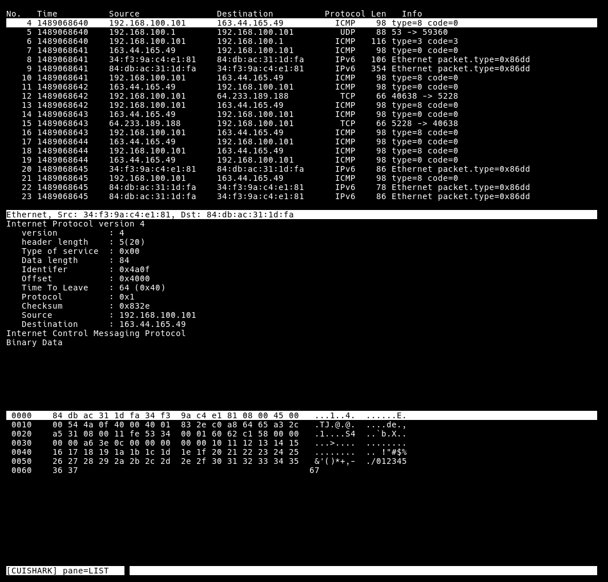

# Cuishark

A protocol analyzer like wireshark on CUI/TUI

master branch [](https://travis-ci.org/slankdev/cuishark)




## Description

This is an implementation like a wireshark on CUI/TUI.  I think using Wireshark
on GUI is really troublesome. So, I wish that using Cuishark is effortless and,
speedy. Cuishark can be controlled by VI-like commands. (ex, hjkl)


## Usage

running ``cuishark`` prints Usage.

```
$ git clone https://github.com/slankdev/cuishark.git
$ cd cuishark
$ make
$ sudo ./cuishark -i eth0                  // network-interface
$ sudo ./cuishark -r input.pcap            // pcap-file-interface
$ sudo ./cuishark -i eth0 -f "tcp port 80" // use pcap-capture-filter
```

If you like CuiShark, ``sudo make install`` to install to ``/usr/local/bin``.

```
$ sudo make install   // install
$ sudo make uninstall // uninstall
```

While running, user can use following commands.

| Command         | Description         |
|:---------------:|:-------------------:|
| j               | cursor down         |
| k               | cursor up           |
| &lt;Tab&gt;     | switch pane         |
| &lt;Space&gt;   | Open/Close element  |


## Support Interface

 - pcap-file
 - network interface
 - PCAP capture filter syntax


## Requirement

 - libpcap
 - libncurses

We assume that users use Ubuntu. If you use another distribution, please change
Package-Manager according to the environment.

```
$ sudo apt install libpcap-dev libncurses5
```


## Release

Current stable version is v0.1.

 - v0.0 [](https://travis-ci.org/slankdev/cuishark)
 - v0.1 [](https://travis-ci.org/slankdev/cuishark)
   - support differential drawing
   - using ncurses-APIs more
 - v1.0 (Support Wireshark Display Filter)

I developed v0.0 with ncurses and c++11. However many implementation don't use
recommended-APIs of ncurses, using original-implementation. So, v0.1 will use
recommended-APIs of ncurses as much as possible.


## License

MIT

see LICENCE.

