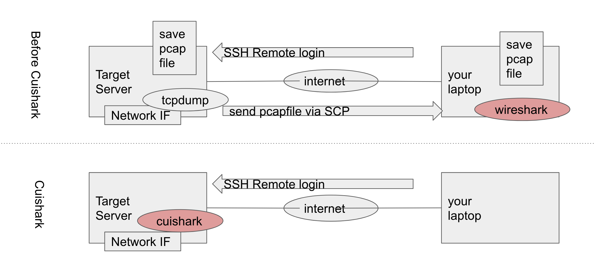

## What's Cuishark?

Cuishark is very-powerful protocol analyzer which has really rich UI.
And you can use such a rich UI for protocol analysis on just CUI without GUI.
Cuishark is using libwireshark for the protocol dissection, so you can
analyze many protocol and your network debug makes better with Cuishark.

## Cuishark makes our network debug more rapidly

Before you use cuishark, if you want to analyze server-side network interface,
you must login via ssh and capture with some packet capture (ex. tshark and tcpdump).
And you must forward capture file to your laptop via SCP. Finally you can
analyze the capture file with wireshrk. like-a above of following image.

Cuishark makes that procedure for analyze server-side network interface better.
You can analyze directory on target server with cui. You don't need GUI for analysis.
like-a under of following image.



You can use powerful UI for prptocol analysis using just CUI. like-a following image.


## Let's Try it on Docker

```
$ docker run -it slankdev/cuishark2
root@c25467cc4f10# cd /root/go/src/github.com/cuishark/cuishark/misc
root@c25467cc4f10# cuishark -r vlan.pcap
```

You can quit from cuishark with enter the ``:quit<CR>`` as well as vim.

## Install Cuishark

```
$ git clone http://github.com/cuishark/libcuishark
$ cd libcuishark
$ ./bootstrap.sh
$ make && sudo make install
$ go get github.com/cuishark/cuishark/cuishark
$ sudo cp $GOPATH/bin/cuishark /usr/local/bin
```

Also, you can test it on docker. This may be easiest way.
```
$ docker run -it --net=host slankdev/cuishark2
root@ubuntu-xenial:/# cuishark -i eth0
```

While running, user can use following commands.

| Command         | Description         |
|:---------------:|:-------------------:|
| j,&lt;down&gt;  | cursor down         |
| k,&lt;up&gt;    | cursor up           |
| &lt;Tab&gt;     | switch pane         |
| &lt;Space&gt;   | Open/Close element  |

## Author and License

Author
- name: Hiroki Shirokura
- email: slank.dev@gmail.com
- twitter: @slankdev
- facebook: hiroki.shirokura

This software is developing under the GPL2.

## Development Roadmap

- version v0.2.0 (WIP, magred master)
	- support to read capturefile and network interface
	- support wireshark's dissector
	- save displayed packet to the pcap-file
	- dynamic display filter update
	- basic character user interface


